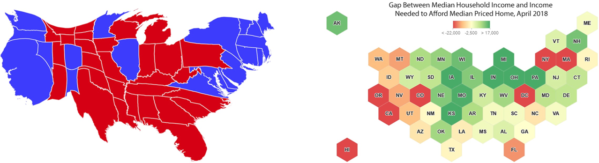
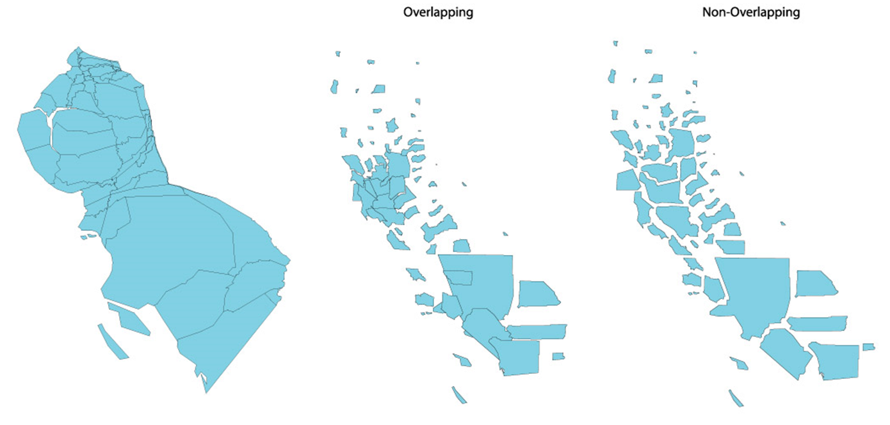
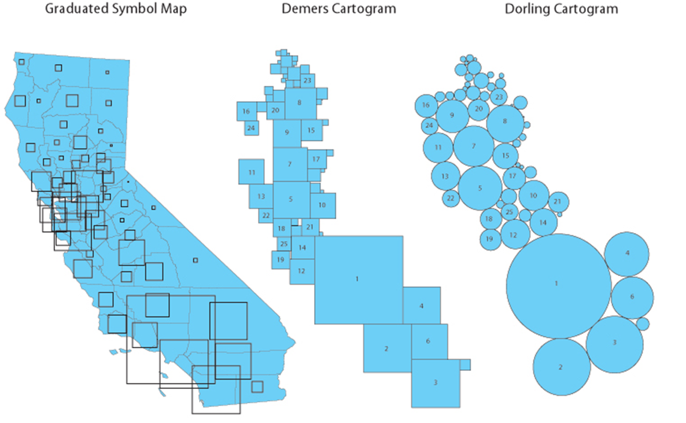
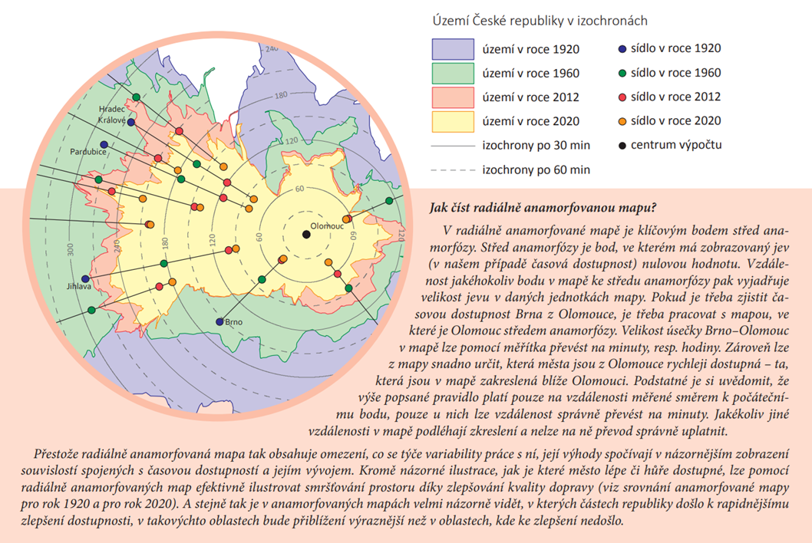

# Pokročilé metody TK

### Pokročilé areálové metody
#### Dasymetrická metoda
#### Value-by-alpha

### Pokročilé kartodiagramy
#### Waffle
Metoda Waffles zobrazuje kvantity kategorií tvořící celek. Je podobná koláčovému grafu, ale má čtvercový nebo mřížkový vzhled. Každá ze složek kategorie je pak v mřížce zobrazena jako opakující se symbol. Symbolika se obvykle provádí pomocí různých odstínů, které reprezentují různé kategorie. Metodu lze rovněž využít pro zobrazení časových řad.

<figure markdown>
  "){ width=500px }
</figure>

[Waffle grid toolbox for ArcGIS](https://carto.maps.arcgis.com/home/item.html?id=d749baac3ede42c3b6f011dc41627b03){ .md-button .md-button--primary .server_name .external_link_icon_small target="_blank"}
[Mapping coronavirus waffles](https://www.esri.com/arcgis-blog/products/arcgis-pro/mapping/mapping-coronavirus-waffles/){ .md-button .md-button--primary .server_name .external_link_icon_small target="_blank"}
{: .button_array}

#### Coxcombs
Coxcomb je varianta na pie chart, který vzniká dělením kruhu rovnoměrných segmentů (např. dle počtu časových úseků), s poloměrem (výseče) lišícím se podle kvantity jevu. Výsledkem jsou segmenty, které se liší rozsahem od středu grafu. Obvykle se používá k zobrazení časových jevů v souladu s původním použitím Florence Nightingale v jejím klasickém diagramu úmrtnosti východních armád z roku 1858.

<figure markdown>
  { width=500px }
</figure>

[Coxcomb toolbox for ArcGIS](https://carto.maps.arcgis.com/home/item.html?id=ebdf8024e9714c7dbfa4f5342634fcdb){ .md-button .md-button--primary .server_name .external_link_icon_small target="_blank"}
[Mapping coronavirus coxcombs](https://www.esri.com/arcgis-blog/products/arcgis-pro/mapping/mapping-coronavirus-coxcombs/){ .md-button .md-button--primary .server_name .external_link_icon_small target="_blank"}
{: .button_array}

???+ tip "Legenda u pokročilých kartodiagramů"
      V případě metody **coxcombs** toolbox sice vytvoří kartodiagramy, ale nadstavba pro tvorbu legendy v layoutu neexistuje. Proto
      je nutné si připravit data způsobem, který zajistí tvorbu legendy již v samotném průběhu vizualizace. Doporučení pro strukturu
      coxcombs tedy zní takto:

      - do tabulky dat přidejte fiktivní záznamy, které budou obsahovat globální minimum a globální maximum (stejné napříč všemi kategoriemi)

      - další (tedy třetí) fiktivní záznam bude obsahovat takové hodnoty, které se objeví v legendě (tzn. vhodně zaokrouhlené a rostoucí po směru hodin)
      
      - pokud záznamy pouze vkládáte jako *Add Row* v atributové tabulce, umístí se do počátku souřadnicového systému; vy však můžete přemístit bod
      reprezentující legendu (třetí fiktivní záznam) do blízkosti mapového obsahu, aby se zobrazil v mapovém okně layoutu.

### Kartografická anamorfóza
Podstatou kartografické anamorfózy (ang. *cartogram*) je deformace geometrického parametru prvku (vzdálenosti nebo plochy) na základě kvantitativní tematické hodnoty (počet obyvatel, cena jízdného, HDP).

Použití je **vhodné** zejména pro data, která výrazně nekorelují s rozlohou jednotek. Zároveň je nutné mít na paměti, že čtenář mapy musí mít povědmoí o zobrazenovaném území, jinak by mohla být mapa matoucí.

Klasifikace kartografické anamorfózy je poměrně složitá a ani v odborné literatuře nepanuje konsenzus. Obrázky níže vystihují rozdíly mezi základními druhy a dále následuje popis tvorby vybraných v softwaru GIS.

<figure markdown>
  { width=800px }
  <figcaption>Spojitá geografická a schematická anamorfóza (tzv. gridded cartogram)</figcaption>
</figure>

<figure markdown>
  { width=500px }
  <figcaption>Rozdíly mezi geografickou spojitou a nespojitou anamorfózou</figcaption>
</figure>

<figure markdown>
  { width=500px }
  <figcaption>Rozdíl mezi kartodiagramem a Dorlingovou, resp. Demersovou schematickou anamorfózou</figcaption>
</figure>

<figure markdown>
  { width=500px }
  <figcaption>Radiální anamorfóza</figcaption>
</figure>

!!! note "Spojitá geografická anamorfóza v QGIS" 
    
    **Příprava dat v ArcGIS Pro** 
    
    - provedeme generalizaci hranic příslušné vrstvy *(Simplify Polygon)*
    - exportujeme příslušnou vrstvu do geojson *(Feature to JSON)*

    **Tvorba spojité geografické anamorfózy v QGIS**

    - pro nový projekt v QGIS nastavíme Křovákovo zobrazení a přidáme příslušnou vrstu
    - v nabídce dostupných pluginů *(Zásuvné moduly-Správa a instalace zásuvných modulů)* vyhledáme plugin *cartogram3* a nainstalujeme
    - spustíme plugin nad příslušnou vrstvou
     
     
    

    <iframe width="560" height="315" src="https://www.youtube.com/embed/tggv-3XlDVU?si=DFH4U2H2-fqZMgZS" title="YouTube video player" frameborder="0" allow="accelerometer; autoplay; clipboard-write; encrypted-media; gyroscope; picture-in-picture; web-share" referrerpolicy="strict-origin-when-cross-origin" allowfullscreen></iframe>
    

    <!-- popis pluginu [**zde**](https://moodle-vyuka.cvut.cz/draftfile.php/12299/user/draft/671901552/MetodyTK_TvorbaMap1-0.pdf){target="_blank"}) -->
    - exportujeme výslednou vrstvy do zvoleného formátu (např. *(ESRI Shapefile)*) pro potřeby finálního zpracování mapy v ArcGIS Pro

    **Finalizace mapy v ArcGIS Pro** 

    - přidáme popis
    - vytvoříme kopii layoutu z předchozího cvičení
    - ponecháme barevnou stupnici pro kartogram (náskok vítěze v %)
    - do legendy doplníme měřítko pro anamorfózu 

    ???+ tip "Měřítko pro anamorfózu"
          Měřítko pro anamorfózu (tj. čtverec o určité ploše = např. 100 volebních hlasů) vypočteme z nové anamorfované plochy celého ORP a celkového počtu hlasů za ORP `ctverec_km2 = 100/!pocet_hlasu_celkem_ORP! - !shape_Area_ORP!/1000000)`. Výsledná hodnota udává velikost plochy (v km2), která odpovídá 100 voličským hlasům – je nutné přepočítat na cm/mm dle měřítka mapy, abychom daný obrazec o správných rozměrech vytvořili v layoutu *(Insert-Graphics)*.

!!! note "Schematická anamorfóza v ArcGIS Pro" 
    - z Esri galerie stáhneme toolbox *[Graphical Cartogram](https://carto.maps.arcgis.com/home/item.html?id=f36049083ce947b08935a67f7184863d)*
    - přidáme stažený toolbox do projektu ArcGIS Pro (*Toolbox – Add New*)
    - použijime nástroj *Create Cartogram,* který se po importu toolboxu objeví mezi nástroji geoprocessingu (na vstupu bude vrstva obcí, jako *Property* vybrat sumu platných hlasů a tvar lze zvolit kruh či čtverec
    - z důvodu navazující tvorby legendy je však nutné do vrstvy obcí pomocí editace přidat tři polygony (umístit je s jistým odstupem od ORP). Není nutné u nich vyplnit jiné atributy než sumu platných hlasů: zde by měly být obsaženy tři hodnoty vhodně vystihující rozsah hodnot tohoto pole (např. 50, 500, 1000 – pokud minimum = 63 a maximum = 987 nebo 5781). Ideálně tedy volit hodnotu těsně pod minimem a těsně nad maximem, avšak pokud je hodnota maxima velmi odlehlá, není (vzhledem k zachování rozumných rozměrů legendy) nutné obsáhnout velikost symbolu pro takovou hodnotu).
    - jakmile nástroj proběhne, vznikne nová anamorfovaná vrstva, u níž pomocí výběru označíme tři přidané prvky pro legendy a pomocí nástroje *Feature to Graphic* překonvertujeme na grafické objekty. S nimi lze pracovat přes lištu *Graphic:* umístíme kruhy tak, aby měly společný dotyk v jejich nejspodnějším bodě a nastavíme transparentní vnitřní výplň (v Layoutu k nim dodáme popisky a linky, inspirace pro legendu například [zde](https://www.esri.com/arcgis-blog/wp-content/uploads/2023/06/cartogram3.jpg))
    - nastavíme barvu pro výplň jednotlivých kruhů (analogicky k předchozím mapám), avšak nástroj *Create Cartogram* bohužel nezachovává veškeré atributy původní vrstvy, proto je nutné nejprve pomocí *Join* připojit informace o procentním rozdílu ve výsledku volebních kandidátů z původní vrstvy obcí (připojit obce a jejich anamorfované verze na základě ID, které zůstává nezměněno).
    - legendu vytvoříme pomocí nástroje <https://radiat.pythonanywhere.com/> (export do SVG a v layoutu vložit jako grafický objekt; poté nesmíte měnit velikost, aby byla legenda platná!)

<!--### Multivariate mapping

-   jako podklad využijeme kvalifikační kartogram (mapa 1)
-   k vrstvě obcí přidáme data o vítězi prvního kola z [databáze ČSÚ](https://vdb.czso.cz/vdbvo2/faces/cs/index.jsf?page=vystup-objekt-parametry&z=T&f=TABULKA&sp=A&skupId=5033&katalog=34015&pvo=VOLDPR202302-OB-OR&str=v103&v=v101__VOLKOLO__1059__1) (nutná úprava v Excelu, ke každé obci stačí vhodnou funkcí vypočíst jméno vítěze 1. kola prezidentské volby)
-   dále se ujistíme, že vrstva obsahuje volební účast (za 2. kolo v %) a počet hlasujících voličů
-   tuto vrstvu převedeme pomocí *Feature to point* na bodovou vrstvu
-   v atributové tabulce přidáme dva sloupce typu string: první bude obsahovat textový přepis volební účasti zaokrouhlený na 1 desetinné místo, druhý bude obsahovat [název barvy](https://www.w3.org/TR/css-color-3/#svg-color) zvolené pro vítězného kandidáta 1. kola (při výběru barvy kontrolujte čitelnost nad celou paletou divergentní stupnice podkladového kartogramu)
-   v symbolice povolit *Allow symbol property connections\
-   primární symboliku nastavit na *Graduated symbols*, přičemž samotný znak (*Template*) nastavit na *Text Marker* (kategorie ArcGIS 2D)
-   Ve vlastnostech symbolu nastavit propojit *Text string* s atributem obsahujícím textový přepis procent volební účasti; poté definovat vhodné velikosti pro každou kategorii, font, halo, apod.
-   Ve vlastnostech symbolu propojit *Color* s atributem obsahujícím definovaný název barvy pro vítěze 1. kola\
-   zvolit vhodnou minimální a maximální velikost symbolu
-   přidat anotace, vytvořit legendu a dokončit layout-->