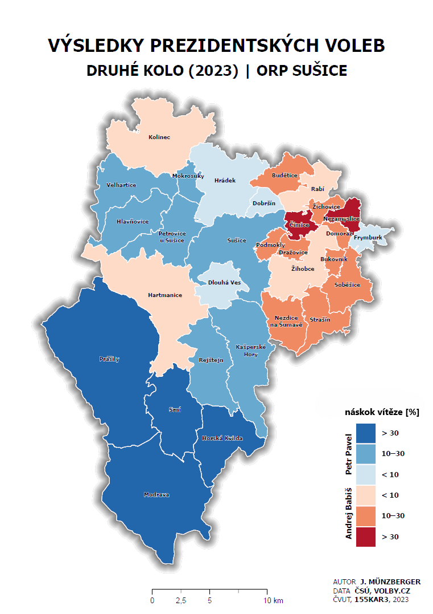
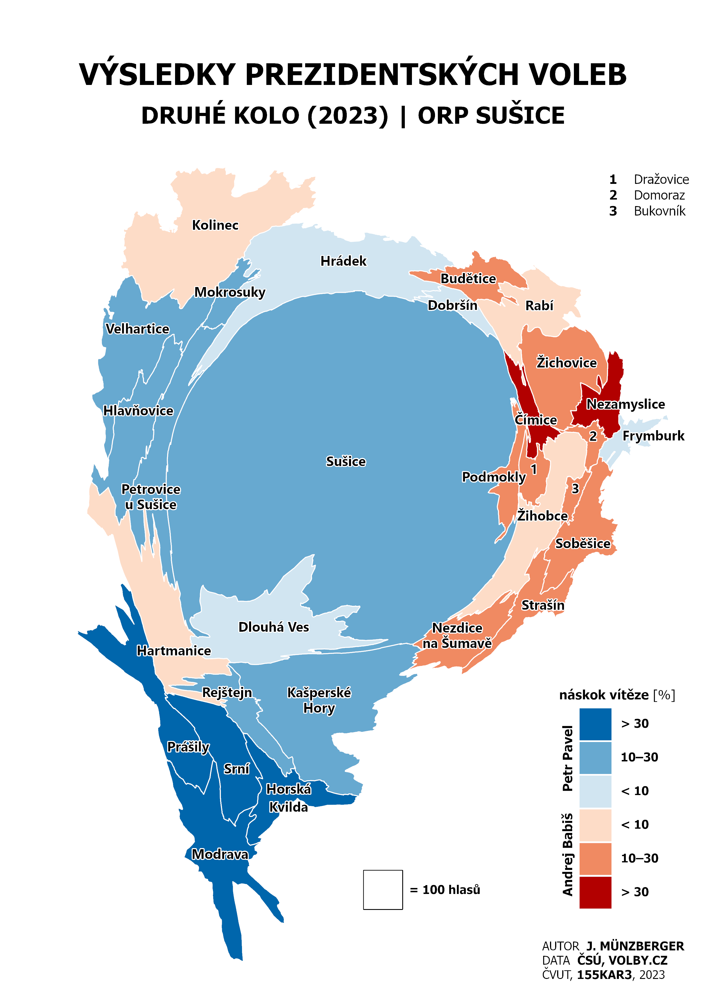
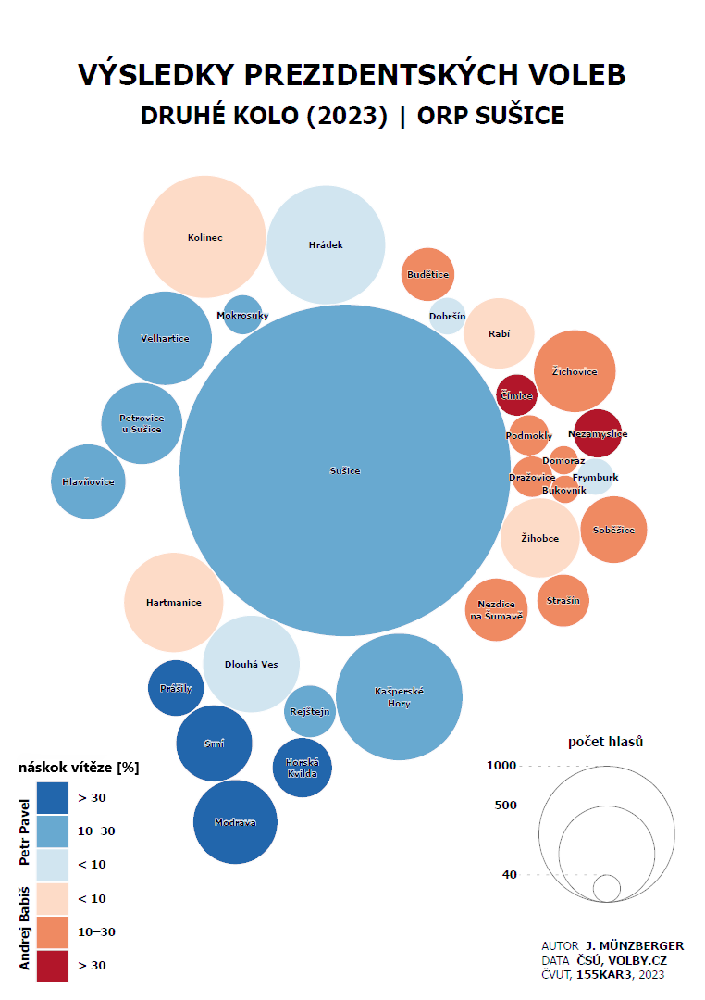
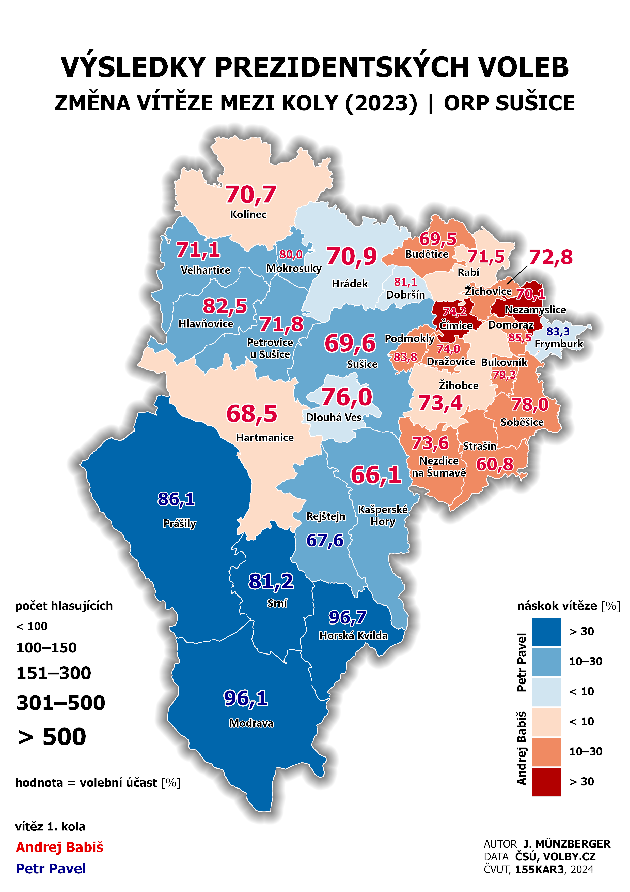

# Úloha II – Pokročilé metody tematické kartografie

## Zadání 

Na úvod cvičení si zopakujeme tvorbu jednoduchého kvalifikačního/klasifikačního kartogramu (Mapa 1). Hlavní náplní cvičení však bude tvorba plošné anamorfózy – geografické spojité (Mapa 2) a schematické, tzv. Dorlingovy anamorfózy (Mapa 3). Vzhledem k tomu, že v ArcGIS Pro dosud neexistuje nástroj pro tvorbu plošné geografické spojité anamorfózy (Mapa 2), budeme tuto část úlohy řešit v QGIS. Postup tvorby kartogramu (Mapa 1) a ostatních typů anamorfózy (Mapa 2 a 3) bude představen v ArcGIS Pro, stejně jako finální kompozice map. Na závěr si ukážeme tvorbu multivariantní mapy (Mapa 4).

**S využitím software QGIS či ArcGIS vytvořte čtyři autorské koncepty tematických map na papír velikosti A4.**

**Mapa 1** bude s využitím jednoduchého kvalifikačního/klasifikačního kartogramu zobrazovat vybraný jev (**náskok vítěze v %**) dle obcí pro vybrané ORP (dle individuálního zadání, viz níže)

<figure markdown>
  { width=400px }
  <figcaption>Mapa 1</figcaption>
</figure>

**Mapa 2** bude s využitím plošné geografické spojité anamorfózy obrazovat vybraný jev (**počet platných voličských hlasů, náskok vítěze v %**) dle obcí pro vybrané ORP (dle individuálního zadání, viz níže)

<figure markdown>
  { width=400px }
  <figcaption>Mapa 2</figcaption>
</figure>

**Mapa 3** bude s využitím plošné schematické (tzv. Dorlingovy) anamorfózy zobrazovat vybraný jev (**počet platných voličských hlasů, náskok vítěze v %**) dle obcí pro vybrané ORP (dle individuálního zadání, viz níže)

<figure markdown>
  { width=400px }
  <figcaption>Mapa 3</figcaption>
</figure>

**Mapa 4** bude s využitím kartogramu a plošného kartodiagramu zobrazovat vybraný jev (**náskok vítěze v %, počet platných voličských hlasů, volební účast v % a vítěze 1.  kola**) dle obcí pro vybrané ORP (dle individuálního zadání, viz níže)

<figure markdown>
  { width=400px }
  <figcaption>Mapa 4</figcaption>
</figure>

## Postup

**Jednotlivá zadání**

-   viz [**tabulka**](https://docs.google.com/spreadsheets/d/1JDwojVnjUDCn3zh-XFYTTY4zu7iO2vEfEV0_wXXACT0/edit?gid=1292987354){target="_blank"}

**Zdroje dat:**

-   polygonová vrstva obcí *(OBCE_UAP)* z ArcČR 4.1
-   výsledky prezidentských voleb z [**Veřejné databáze ČSÚ**](https://vdb.czso.cz/vdbvo2/faces/cs/index.jsf?page=vystup-objekt-parametry&z=T&f=TABULKA&sp=A&skupId=5033&katalog=34015&pvo=VOLDPR202302-OB-OR&str=v103&v=v101__VOLKOLO__1059__1){target="_blank"} dle ORP (platné hlasy, druhé kolo)

**Příprava dat**

-   úprava tabulky z [VD ČSÚ](https://vdb.czso.cz/vdbvo2/faces/cs/index.jsf?page=vystup-objekt-parametry&z=T&f=TABULKA&sp=A&skupId=5033&katalog=34015&pvo=VOLDPR202302-OB-OR&str=v103&v=v101__VOLKOLO__1059__1){target="_blank"} (ponechat jen záhlaví sloupců a data) 
-   připojení upravené tabulky k vrstvě obcí v daném ORP *(nastavení Definition Query)*
-   export nové vrstvy *(Data-Export Features)*
-   výpočet nových atributů (`PP_podil`, `AB_podil`, `vitez_rozdil_rel`)

**Postup zpracování**

- [kartogram](https://k155cvut.github.io/kar2/kartogram/) (Mapa 1)
- [kartografická anamorfóza](https://k155cvut.github.io/kar3/advanced/#kartograficka-anamorfoza) (Mapa 2 a 3)
- [multivariantní mapa](https://k155cvut.github.io/kar3/advanced/#multivariantni-mapy) (Mapa 4)

## Výstupy cvičení
Povinným výstupem úlohy je __technická zpráva v elektronické podobě__ odevzdaná v termínu prostřednictvím systému [__Moodle__](https://moodle-vyuka.cvut.cz/mod/assign/view.php?id=399548){.color_def .underlined_dotted .external_link_icon target="_blank"}.

???+ note-grey "Požadované náležitosti technické zprávy"
    -   stručný postup řešení úlohy (použitý sw, nástroje apod.),
    -   zdůvodnění případných "neobvyklých" kroků v úpravě dat (např. tvorba pomocných polygonů pro diagramové měířtko apod.),
    -   vztah pro výpočet velikosti hodnotového měřítka plošné geografické spojité anamorfózy + zdůvodnění,
    -   tabulku s daty a mezivýpočty,
    -   zhodnocení vhodnosti použití aplikovaných metod (která je pro dané téma názornější, lépe vystihuje skutečnost apod.),
    -   zhodnocení vhodnosti softwaru pro tvorbu dané metody,
    -   povinnou přílohou jsou **všechny vytvořené tematické mapy na formát A4 **;

## Hodnocení
Úloha je uznána (stav splněno/nesplněno), pokud jsou splněny následující podmínky:

-   úplnost technické zprávy (obsah TZ viz výše)
-   splnění zásad tematické kartografie (viz [**povinná kritéria**](https://docs.google.com/spreadsheets/d/1JDwojVnjUDCn3zh-XFYTTY4zu7iO2vEfEV0_wXXACT0/edit?gid=0))

!!! warning "Opravy"
    V případě, že odevzdaný výstup není správný, je vyučujícím prostřednictvím systému Moodle __vrácen k opravě__. Opravený výstup se odevzdává opět prostřednictvím systému [__Moodle__](https://moodle-vyuka.cvut.cz/mod/assign/view.php?id=399548){.color_def .underlined_dotted .external_link_icon target="_blank"} vždy nejpozději do 7 dní od vrácení úlohy. Výstup lze odevzdat po __maximálně dvou opravách__, v případě pozdního odevzdání či nesprávného výstupu po druhé opravě je úloha __trvale označena jako nesplněná__{style="color:#c22521;"}.

## Termíny

- odevzdání 1: __neděle 16. listopadu 2025__{.outlined}
- odevzdání 2 (oprava 1): __neděle 30. listopadu 2025__{.outlined}
- odevzdání 3 (oprava 2): __neděle 14. prosince 2025__{.outlined}

    