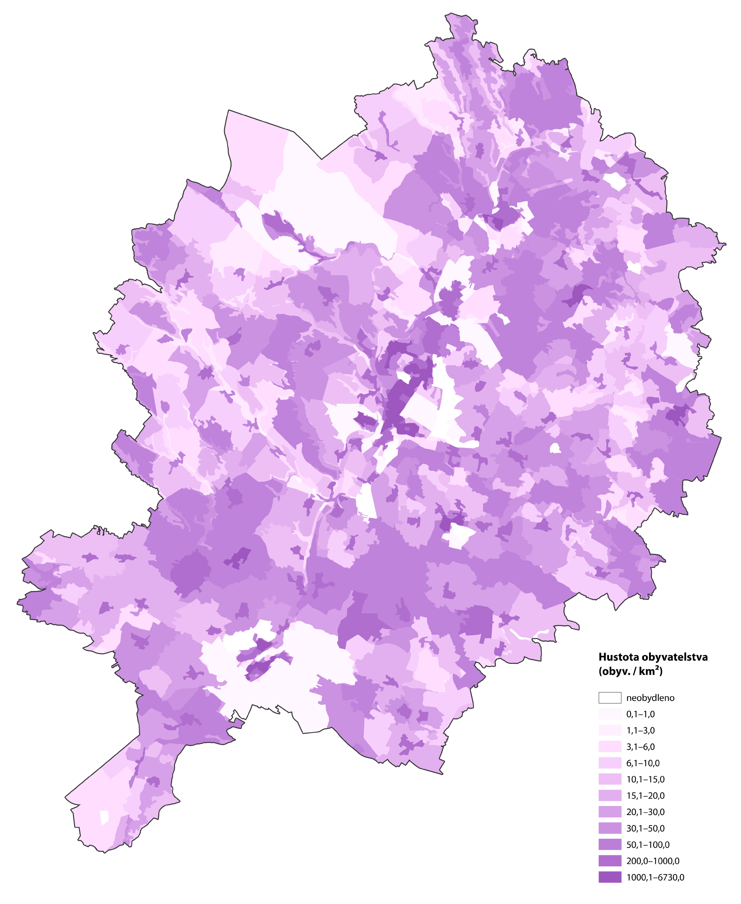

# Úloha IV – Analýza území

## Zadání úlohy

**Zpracujte trojici map zadaného okresu, která bude zobrazovat:**

- **mapa I**: stav plynofikace, napojení na kanalizaci a způsob vytápění stavebních objektů \[areálová metoda; elektronicky\];
- **mapa II**: ohniska rekreace v okresech \[metoda intenzity jevu; formát A4\];
- **mapa III**: hustota obyvatelstva \[dasymetrická metoda; formát A3\]. 

!!! tip

    **Jednotlivá zadání:**

    -   01 – Jičín
    -   02 – Semily
    -   03 – Rakovník
    -   04 – Strakonice
    -   05 – Nymburk
    -   06 – Tachov
    -   07 – Teplice
    -   08 – Kutná Hora
    -   09 – Kladno
    -   10 – Mělník
    -   11 – Jihlava
    -   12 – Uherské Hradiště
    -   13 – Kroměříž
    -   14 – Písek
    -   15 – Tábor
    -   16 – Beroun
    -   17 – Blansko
    -   18 – Svitavy
    -   \<volné\> – Hradec Králové
    

Využijte data RÚIAN, do kterého se z katastru nemovitostí přenášejí mj. údaje o parcelách a stavebních objektech (v příp. ArcGIS Pro možno využít službu ArcGIS serveru na [***ags.cuzk.cz \> RUIAN \> Prohlizeci sluzba nad daty RUIAN***](http://ags.cuzk.cz/arcgis/rest/services/RUIAN/Prohlizeci_sluzba_nad_daty_RUIAN/MapServer){target="_blank"}, kterou je možné stáhnout pomocí *Select* za vybrané území okresu, příp. nastavte *Processing Extent* v *Environments*).

Mapu I zpracujte jako WebMap publikovanou na ArcGIS Online. Dílčí vrstvy publikujte dle potřeby jako Feature Layer nebo Tile Layer (*Share \> Web Layer*). Mapy II a III budou formou klasického mapového layoutu na formát A4, resp. A3.

**Mapa I**

Jako podklad použijte vhodnou podkladovou mapu (ZTM10, ZABAGED, vrstvy basemap z AG Online či jinou dle svého uvážení), příp. doplňte základními vrstvami typu komunikace apod., lze převzít např. z DATA50 (na disku S: pod katedrou ve složce Data\\ArcGIS).
Ve třech samostatných zapínatelných vrstvách publikujte plynofikaci, kanalizaci a vytápění za jednotlivé objekty, vhodně vizualizujte jev divergentní barevnou stupnicí, aby bylo zřejmé splnění/nesplnění jevu, příp. různé možnosti (u vytápění).

**Mapa II**

Jako podklad použijte vhodnou mapu v potlačených barvách.
Mapa bude obsahovat lesní prostory (použijte např. Data50), vhodně vizualizované – šrafurou, tečkováním apod. Nad podkladem budou rekreační objekty vizualizované formou tzv. metody intenzity jevu (heat-map). 

Pro intenzitní mapu využijeme stavební objekty z předchozí mapy. Zajímat nás budou budovy dvou typů: 
stavba pro rodinnou rekreaci – dle číselníku využití stav. objektů **kód 8** a  
stavba ubytovacího zařízení – dle číselníku **kód 11**. 

Tyto budovy si tedy vyfiltrujeme a pomocí *Feature to point* převedeme na bodovou vrstvu – intenzitní mapa lze volit jako vizualizační metoda pouze pro bodové třídy prvků.
Tyto objekty budeme považovat pro účely úlohy jako indikátor turismu. Je zřejmé, že hromadná ubytovací zařízení představují v rámci turistického využívání krajiny stěžejní položku, nastavíme jim tedy 10× větší váhu (samozřejmě ideální by bylo mít počty lůžek jednotlivých zařízení, ty však k dispozici nemáme). Tedy si zvolíme nový atribut např. *VAHA* a stavbám s kódem 8 vložíme jedničku, stavbám s kódem 11 hodnotu 10.

V panelu *Symbology* pro tuto bodovou vrstvu lze zvolit *Heat Map* jako metodu vizualizace. Použijeme metodu konstantní a zvolit zde lze *Radius* – tedy hodnotu dosahu jednotlivých bodů v rámci výpočtu. Nižší akční rádius značí více izolované plošky, vyšší způsobí kompaktnější pokrytí prostoru. Je vhodné rádius zafixovat pro hodnotu měřítka, ve kterém bude mapa následně exportována (a toto měřítko mít samozřejmě nastaveno jako referenční ve vlastnostech výkresu). *Weight field* potom značí váhu jednotlivých bodů – použijeme zde připravený atribut *VAHA.*

Specifikem vizualizace pomocí intenzitní mapy (na rozdíl např. od geostatistických vizualizací) je poloprůhledná část barevné stupnice, což způsobí, že oblasti s nízkými intenzitami nejsou v mapě viditelné a vystupují pouze oblasti od určité intenzity. Metoda poměrně dobře a čtivě umožňuje vizualizovat nestejnoměrnou distribuci jevu v prostoru a oblasti jeho koncentrace, na druhou stranu neumožňuje přesný odečet hodnoty v žádném bodě – jedná se pouze o neurčitou vizualizaci trendu. 

**Mapa III**

*Jako podklad použijte data ZSJ z RÚIAN (dostupné na na disku S: pod katedrou ve složce Data\\ArcGIS\\ZSJ+CLC.gdb)*. K nim je třeba pomocí funkce *Add join* připojit atribut s počty obyvatel. Databázové soubory DBF s daty základních sídelních jednotek včetně počtů obyvatel naleznete na webu ČSÚ v sekci [RSO (Registr sčítacích obvodů)](https://apl2.czso.cz/irso4/export1.jsp?). Zde vyberete:

- Číselník: **Základní sídelní jednotky**;
- Omezující podmínka: **OKRES \> *váš zadaný okres***;
- Výběr sloupců vazeb: **žádné**;
- Výběr sloupců atributů: **POCOBYOSL2** (obvyklý počet obyv. dle SLDB 2021)

a necháte vyexportovat v kódování 1250. Ve sloupci *KOD* takto vytvořeného DBF souboru pak naleznete kód ZSJ, který odpovídá kódu ZSJ ve výše stažené geodatabázi základních sídelních jednotek. Tyto dva atributy je tedy třeba ve funkci *Add join* nastavit jako propojovací. Vrstvu ZSJ můžete omezit na příslušný okres zvolením příslušného kódu okresu (atribut *LAU1_KOD)* např. jako Definition query – tedy např. pro okres Most bude def. query rovno `LAU1_KOD = 'CZ0425'`

Mapa bude brát v potaz rozptýlení obyvatelstva v ploše s přihlédnutím ke krajinnému pokryvu – zde využijte data CORINE Land Cover za rok 2018 (jsou také součástí výše stažené GDB).

Pro plochy volte následující váhy:

| KÓDY          | TYP                                     | VÁHA |
|---------------|-----------------------------------------|-----|
| 111 až 112    | zástavba                               | 0,81|
| 121 až 124    | zástavba industriální či komerční        | 0,02|
| 131 až 133    | lomy či neplodná půda                   | 0,00|
| 141 až 142    | zástavba se zelení                      | 0,10|
| 211 až 243    | zemědělská půda                        | 0,05|
| 311 až 324    | lesní plochy                           | 0,02|
| 332 až 512    | skály, vodní plochy a ostatní           | 0,00|

Je tedy třeba sloučit tyto skupiny ploch dohromady a do nového atributu uložit příslušnou váhu. Pak pomocí funkce *Union* vytvořit průniky ZSJ a plošek CLC, čímž vzniknou díly ZSJ. Jim se pak nastaví pro každou ZSJ počty obyvatel jednotlivých dílů dle vah.

Tedy, má-li např. hypotetická ZSJ Lhota 500 obyvatel, rozdělí se tito do dílů (existují-li všechny):

- zástavba – 405 obyvatel;
- zást. industr. – 10 obyvatel;
- zást. se zelení – 50 obyvatel;
- zeměd. půda – 25 obyvatel;
- lesy – 10 obyvatel;
- vše ostatní – 0 obyvatel.

Pokud všechny váhy v dané ZSJ neexistují (což nastane většinou), je potřeba pomocí funkce *Summarize Within* přepočítat aktuální váhy vůči součtu těch, které v dané ZSJ jsou přítomné. Tedy např. při vahách jen 0,02 a 0,05 vydělit váhy 0,02 a 0,05 jejich součtem, tedy 0,07. Vzniknou tak normované váhy 0,286 a 0,714. Těmi pak lze násobit počty obyvatel v každém dílu a zjistit odhad skutečného rozložení obyvatel v ploše.
Ve funkci *Summarize Within* volte jako vstup vrstvu ZSJ a jako *Summary features* vrstvu dílů, kde jako statistiku zvolíte *Sum* (součet). Tím získáte součet vah, nutný pro přepočet vah v atributu *VAHA*.

Pro vizualizaci volte obdobnou metodiku, jako by se jednalo o kartogram (různé jasové hodnoty jednoho odstínu barvy dle hustoty obyvatel váženého dílu). Každý díl bude vizualizovat touto stupnicí hustotu obyvatelstva, tedy přepočtený počet obyvatel z výše uvedeného postupu, dělený rozlohou a násobený 1 000 000 z důvodu přepočtu na čtvereční kilometr. Díly s nulovou hustotou zůstanou zcela bílé. 
 

<figure markdown>
  {style="width: 50%"}
  <figcaption>Ukázka výsledné dasymetrické mapy. <b>Nejedná se o kompletní layout</b></figcaption>
</figure>

!!! warning "K odevzdání"
    
    ## Požadované výstupy

    -  Nahrát potřebné vrstvy pro Mapu I na AG Online, vytvořit webmapu (Web Map) a pojmenovat ji KAT3_2024\_*iniciály*\_Mapa1.
    -  Do Moodle vložit Mapu II, resp. III jako PDF ve formátu A4, resp. A3 včetně všech kompozičních prvků.
    -  Technickou zprávu není třeba zpracovat.

    **Termín odevzdání**: pátek 27. prosince 2024, 16 hodin.

